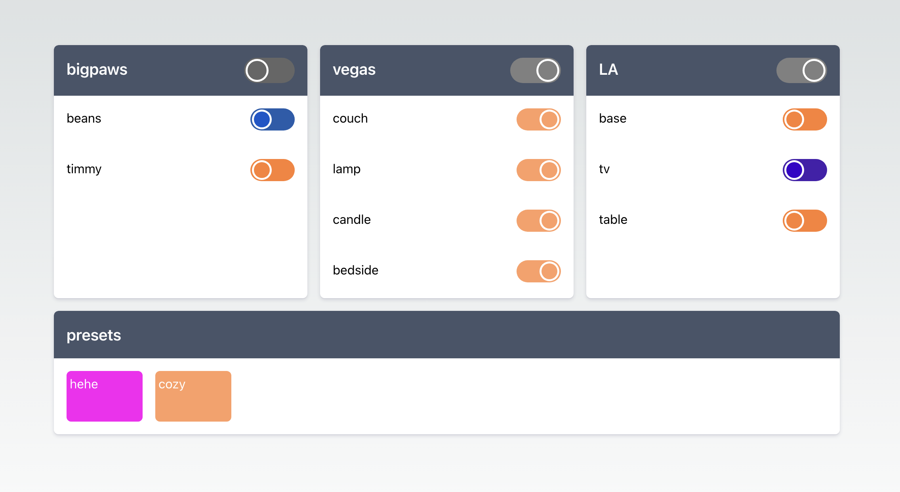
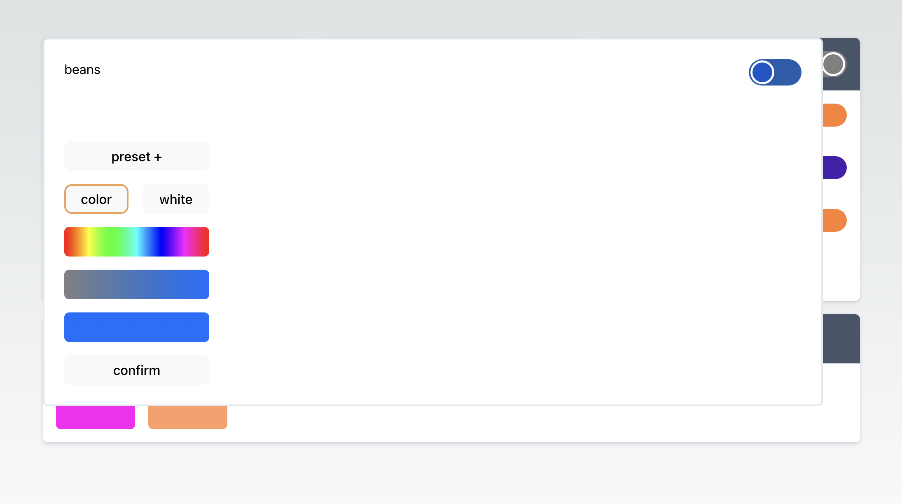
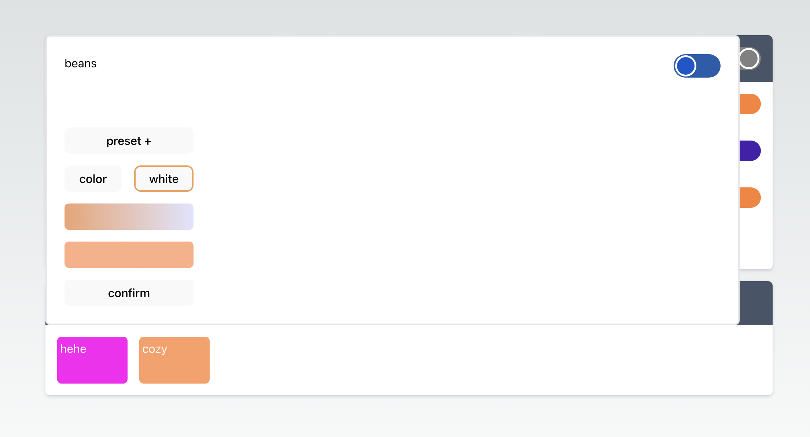

# lifx-controller

web controller for lifx ଘ(๑ ｀ ᵕ ´) ๑ ━☆ ﾟ ✶｡˖⁺ ✦ ⋆˙⊹ 𓆏⁺‧₊
(for when you can't find your phone)





## Launching the Application Locally

To run the this project on your local machine, please follow the steps below:

1. **Clone the repository:**

   ```bash
   git clone https://github.com/danielbuva/lifx-controller
   ```

2. **Install Dependencies:**

- At the root directory:
  ```bash
  bun install
  ```
- Navigate to the server directory:
  ```bash
  cd server
  bun install
  ```
- Navigate to the client directory
  ```bash
  cd ../client
  bun install
  ```

3. **Create a .env file in the server directory** with the following content:

   ```plaintext
   TOKEN=[token generated from lifx]
   ```

4. **Start the server and client servers:**

- In the server directory run:
  ```bash
   bun dev
  ```
- In the client directory run:
  ```bash
  bun dev
  ```
- Or at the root run
  ```bash
  bun client
  ```
  and
  ```bash
  bun server
  ```

7. **Access the application:**

- Open your web browser and visit http://localhost:5173 to access the lifx controller.
